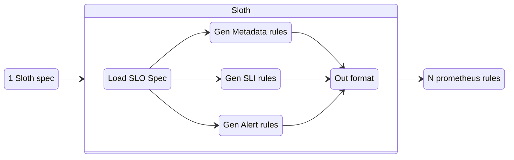

## How does it work

Sloth uses Prometheus rules to generate SLOs. Based on the generated [recording][prom-recordings] and [alert][prom-alerts] rules it creates a reliable and uniform SLO implementation:



The Prometheus rules that Sloth generates, fall in 3 categories:

- **SLIs**: These rules are the base, they use the queries provided by the user to get a value used to show what is the error service level (availability). It creates multiple rules for different time windows, these different results will be used for the alerts.
- **Metadata**: These are used as informative metrics, like the remaining error budget, the SLO objective percent... These are very handy for SLO visualization, e.g Grafana dashboard.
- **Alerts**: These are the [multiwindow-multiburn][mwmb] alerts that are based on the SLI rules.

Sloth will take the service level spec and for each SLO in the spec will create 3 rule groups with the above categories.

## Metrics

The Sloth generated rules will share the same metric name across SLOs. However the labels are the key to identify the different services, SLO... This is how we obtain a uniform way of describing all the SLOs across different teams and services.

To get all the available metric names created by Sloth, use this query:

```text
count({sloth_id!=""}) by (__name__)
```

## Alerts

Sloth SLO alerts use [multiwindow-multiburn][mwmb] method. It will generate 2 types of alerts:

- Critical/page: Pay attention right now.
- Warning/ticket: Take into account, however is not urgent.

Using 4 different alerts across different time window periods:

- Critical/Page in short time window: Very very high rate of burning budget.
- Critical/Page in medium time window: High rate rate of burning budget.
- Warning/Ticket in medium time window: Constant normal rate of burning budget.
- Warning/Ticket in long time window: Constant low rate of burning budget.

Sloth doesn't trigger/generate the alerts itself, [Prometheus] will by using Sloth generated alerting rules. Normally something connected with Prometheus (like [alertmanager]) will trigger these alerts notifications (e.g Slack, Pagerduty...).

[prom-recordings]: https://prometheus.io/docs/prometheus/latest/configuration/recording_rules/
[prom-alerts]: https://prometheus.io/docs/prometheus/latest/configuration/alerting_rules/
[mwmb]: https://landing.google.com/sre/workbook/chapters/alerting-on-slos/#6-multiwindow-multi-burn-rate-alerts
[prometheus]: https://prometheus.io/
[alertmanager]: https://github.com/prometheus/alertmanager
