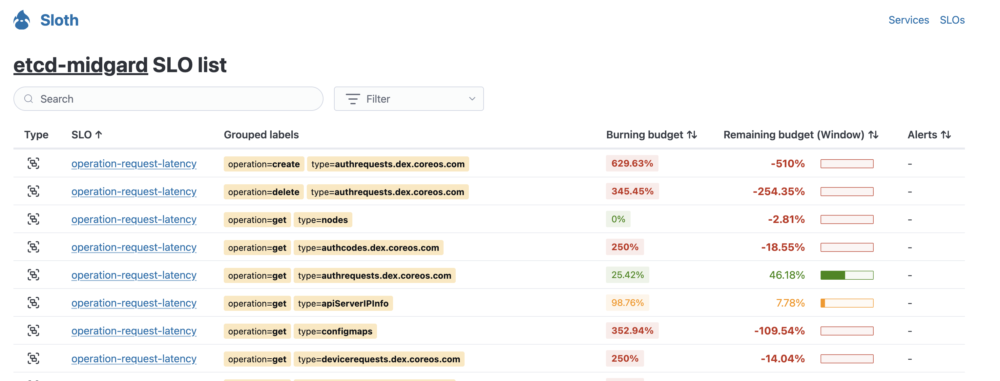
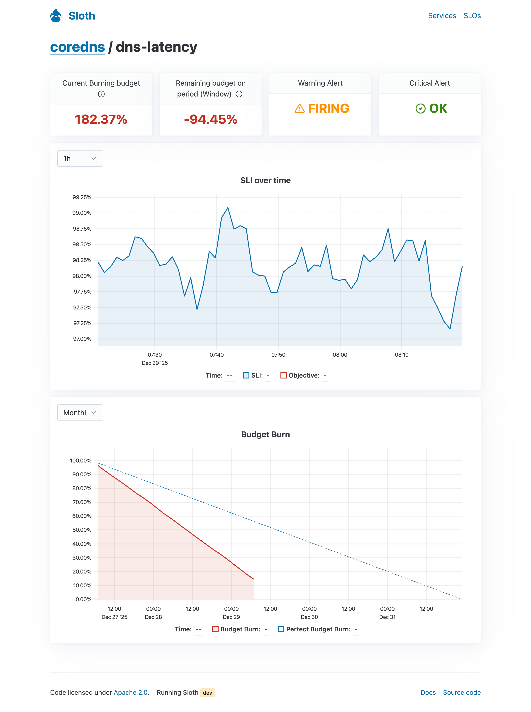

Sloth provides different ways to visualize and interact with your SLOs, helping you with discovery, status monitoring, debugging, and incident troubleshooting.

## Built-in UI

!!! warning "Experimental"
    The built-in UI is an experimental feature that is being actively iterated and will evolve over time.

!!! warning "Custom SLO plugins compatibility"
    If you use very specific or custom SLO plugins, the UI may not work correctly. The UI attempts to infer all SLOs as much as possible, but highly customized plugins might break the visualization.

Sloth includes a built-in web UI that allows you to explore and monitor the SLOs generated by Sloth. This UI provides real-time visibility into your services, SLOs, and their current status directly from Prometheus metrics.

### Running the UI

The built-in UI is served from the Sloth binary using the `sloth server` command:

```bash
sloth server
```

Once started, the UI will be available at `http://localhost:8080` (by default).

### Service List

The service list view provides a high-level overview of all your services and their health status.


Key features:

- **Service overview**: See all services monitored by Sloth in one place.
- **Alert status**: Quickly identify services with currently triggering alerts.
- **Service health**: Monitor the overall health across your service catalog.

### SLO List

The SLO list view shows all SLOs in the system, with powerful filtering and grouping capabilities.




Key features:

- **Comprehensive SLO catalog**: Browse all SLOs across your services.
- **Advanced filtering**: Filter SLOs by service, labels, and other criteria.
- **Label grouping**: View SLOs organized by label combinations. When SLOs are defined with dynamic label grouping, a single SLO declaration expands into multiple SLOs based on label values.
- **Quick status check**: See SLO compliance and error budget at a glance.
- **Service drill-down**: View all SLOs for a specific service.

!!! tip "Label grouping power"
    Label grouping is a powerful feature that allows you to monitor multiple SLOs generated from a single definition. This capability is unique to the built-in UI and not available in the Grafana dashboards.

### SLO Details

The SLO details view provides in-depth information about a specific SLO, including its current status, error budget, and alert states.



Key features:

- **SLO metadata**: View objective, SLI specification, and other SLO configuration details.
- **Error budget**: See remaining error budget and burn rate.
- **Alert status**: Check the current state of associated alerts.
- **Real-time metrics**: Monitor SLI performance and trends.
- **Debugging information**: Access detailed information for troubleshooting and incident response.

## Grafana Dashboards

Sloth also comes with [Grafana] ready-to-use dashboards that can be imported and used alongside the built-in UI.

### Detailed SLOs

**Get it [here](https://grafana.com/grafana/dashboards/14348)**

This dashboard features a detailed view of each of the SLOs.


Every SLO will show:

- SLI.
- SLO metadata details (name, objective...).
- SLO Burn rate.
- Remaining error budget for the current month (Since 1st).
- Remaining error budget for the last 30 days.
- In case of enabled alerts, show the state of the current alerts.
- Error budget month burndown chart.
- Burn rate magnitude.


Apart from this, the dashboard has a general view of the current exceeded SLO list and graph.

### High level overview

**Get it [here](https://grafana.com/grafana/dashboards/14643)**

This dashboard shows a high level overview of all the SLOs in the system managed by Sloth. Normally this
dashboard will be used to check correlation between SLO error budget burns.


This dashboard comes with:

- Information of SLOs (quantity, average burn rate of all, triggering alerts...).
- Graph and tables of the SLOs currently burning budget at high rates.
- Timeline with all SLOs error budget burns.

[grafana]: https://grafana.com/
