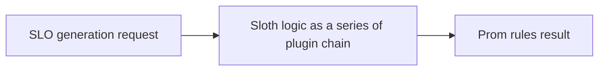
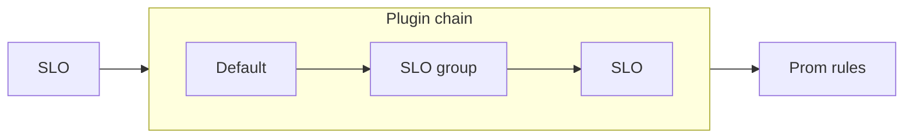

!!! warning "Advanced usage"

    SLO plugins require an advanced usage and knowledge of Sloth SLO generation, they are powerful but complex, if you don't need them, and the default Sloth usage meets your needs, don't use them.

!!! note "Version"
    SLO plugins are available on Sloth `>=v0.13.0`.

!!! note "Supported specs"

    SLO plugins are supported by [regular](../specs/default.md) and [k8s](../specs/kubernetes.md) Sloth specs.

!!! note "Ideas for new SLO plugins?"

    If you have any idea that would be cool to support on the community, open a [discussion thread][discussions]

## Introduction

SLO plugins are an extensibility mechanism in Sloth that allow you to customize the SLO rules generation process. They let you add, modify, or extend the behavior of Sloth's core functionality without modifying Sloth itself. **In other words, you can change or extend all the Sloth SLO rule generation logic to adapt to your needs.**

While [SLI plugins](./sli-plugins.md) allow you to define how SLI queries will be (e.g: service latency, availability...), SLO plugins operate on the whole SLO specification. They can mutate the whole Prometheus generation process like injecting metadata, changing rule intervals, generate new alerts, or even mutate the SLO configuration programmatically.

## Plugin chaining

SLO plugins work similar to a processor chain, if you are familiar with HTTP middlewares, this is similar, the SLO will pass
over and over though a series of chained plugins and these plugins can change the result of the SLO. Take into account that this is
very powerful, as you can add, mutate or even override results generated from previous executed plugins.



SLO plugins form a processor-like chain, similar to HTTP middlewares, where each plugin can modify the SLO rules generation result as it passes through. This mechanism is powerful: plugins can add, mutate, or override data from earlier stages in the chain.

The plugin chain is composed of three layers, applied in this order:

- Default plugins: These are the plugins that Sloth will execute by default (Sloth SLO validation and rule generation core logic).
- SLO group level plugins: These are the plugins declared at the Service level that groups N SLOs
- SLO level plugins: These are the plugins declared at the isolated SLO level.

The SLO plugin chain will be generated by aggregating plugins in order: `Default plugins` + `SLO group plugins` + `SLO plugins`:



!!! Info "Custom order"

    Use [Priority](#priority) setting on the SLO plugin declaration spec to change the chain order. For example to be able to execute a custom validation before the default validation Sloth plugin is executed.

## Priority

A plugin without priority will be `priority: 0`. Default Sloth plugins, run at priority `0`. When 2 plugins have the same priority, declaration order will be maintained.

If you want a plugin be executed before other, it should have a lesser priority number. This means that a plugin with priority `10` will be executed before a plugin of priority `20`.

There is no restriction on the priority numbers, and can be negative. This means that if you want a plugin to be executed before default plugins, it should have a priority `<0`, and if you want to execute a plugin after the default plugins, should be `>=0`.

!!! tip "Round numbers"

    Use round numbers, that makes it easy to reason about. Examples: `1000`, `3000`, `2500`, `-100`, `-5000`, `-9999999999`...


## Plugin declaration spec

A Plugin declaration is composed of:

- ID: The unique ID of the plugin loaded by Sloth.
- Configuration: The configuration that will be given to the plugin when it's created.
- Priority: The priority of the plugin, by default `0`.

An SLO plugin declaration block:

```yaml
id: "sloth.dev/core/debug/v1"
priority: 9999999
config:
  msg: "Plugin 99"
```

As stated before, the plugins can be declared at different levels (SLO group and SLO). Lets see an example:

```yaml
version: "prometheus/v1"
service: "myservice"
#...
slo_plugins:
  chain:
    - id: "sloth.dev/core/debug/v1"
      priority: 1000
      config:
        msg: "Plugin 3"

slos:
  - name: "slo1"
    plugins:
      chain:
        - id: "sloth.dev/core/debug/v1"
          config:
            msg: "Plugin 2"
        - id: "sloth.dev/core/debug/v1"
          priority: -999999
          config:
            msg: "Plugin 1"
    #...
    - name: "slo2"
    plugins:
      chain:
        - id: "sloth.dev/core/debug/v1"
          config:
            msg: "Plugin 1"
#...
```

This SLO plugin declaration will execute in order and print the debug message:

- `slo1`: `Plugin 1` -> (default plugins) -> `Plugin 2` -> `Plugin 3`.
- `slo2`: (default plugins) -> `Plugin 1` -> `Plugin 3`.

!!! tip "One liner config"

    YAML supports also one liners by using `{}` on maps/objects. So you can declare plugins with `config` as one liners, this can be something handy when there are big configurations or lots of plugins. Example:

    From this:

    ```yaml
    - id: "sloth.dev/core/debug/v1"
      config:
        msg: "Plugin 2"
    - id: "sloth.dev/core/debug/v1"
      priority: -999999
      config:
        msg: "Plugin 1"
    ```

    To this example:

    ```yaml
    # One liner on the config.
    - id: "sloth.dev/core/debug/v1"
      config: {msg: "Plugin 2"}
    # One liner on all the plugin.
    - {id: "sloth.dev/core/debug/v1", priority: -999999, config: {msg: "Plugin 1"}}
    ```

## Built-in plugins

- [`sloth.dev/core/alert_rules_v1`](https://github.com/slok/sloth/tree/main/internal/plugin/slo/core/alert_rules_v1): Default Sloth Prometheus alert rules generation.
- [`sloth.dev/core/debug_v1`](https://github.com/slok/sloth/tree/main/internal/plugin/slo/core/debug_v1): A debugging plugin that can be used to show data received in the plugin.
- [`sloth.dev/core/metadata_rules_v1`](https://github.com/slok/sloth/tree/main/internal/plugin/slo/core/metadata_rules_v1): Default Sloth Prometheus metadata recording rules generation.
- [`sloth.dev/core/noop_v1`](https://github.com/slok/sloth/tree/main/internal/plugin/slo/core/noop_v1): A noop plugin.
- [`sloth.dev/core/sli_rules_v1`](https://github.com/slok/sloth/tree/main/internal/plugin/slo/core/sli_rules_v1): Default Sloth Prometheus SLI recording rules generation.
- [`sloth.dev/core/validate_v1`](https://github.com/slok/sloth/tree/main/internal/plugin/slo/core/validate_v1): Default Sloth validation of SLOs.

## Loading plugins in Sloth

All plugins (SLI and SLO) in sloth are discovered the same way, even with the same flag. Use the flag `--plugins-path` or short `-p`. This flag can be repeated to give N paths. The directories given will be used to search for plugins recursively.

Example:

```bash
sloth kubernetes-controller  -p ./plugins/ -p ../ext-plugins
INFO[0000] Plugins loaded                                sli-plugins=15 slo-plugins=24 version=dev window=30d
```

## Developing plugins

SLO plugins are Go plugins loaded and executed using [Yaegi] engine.

To ensure portability and stability, plugins must follow a few structural [requirements](#requirements). However, the most important aspect is how a plugin is loaded, instantiated, and executed. At the core of this is the [`slov1.Plugin`][plugin-go-interface] interface, which all plugins must implement.

When Sloth loads a plugin, it invokes a factory method named `NewPlugin`. This method receives two arguments:

- App utilities: Provided by Sloth to give access to helpful features like logging.
- Plugin configuration: Passed as a `json.RawMessage`, is the configuration the user configured when declaring the plugin.

Sloth SLO plugins work at single SLO level, meaning that plugins will be call one SLO at a time.

Once Sloth has instantiated your plugin, it adds it to the plugin execution chain. When it is your plugin’s turn to run, Sloth will call the plugin’s `ProcessSLO` method with three arguments:

- Context: The Go [`context.Context`](https://pkg.go.dev/context#Context) for managing cancellation, deadlines, context information share...
- Request: Contains the full input SLO specification model and all associated metadata.
- Result: Represents the output that Sloth will generate for the given SLO.

Both Request and Result are passed as pointers, so your plugin can freely mutate them. In most cases, plugins only modify the Result, but modifying the Request is also allowed when needed. Finally the plugins can return an error if something went wrong that will make all the plugin chain fail.


!!! warning "Mutating Request"
    
    Take into account that mutating Request object can have side effects, is not recommended but its possible.

!!! note "`json.RawMessage` as configuration"

    Plugin configuration in Sloth is schemaless by design. Since Go is a statically typed language, there is no perfect built-in way to handle dynamic types, especially when different plugins may expect different configuration formats.

    To solve this, Sloth uses `json.RawMessage` for plugin configuration. This gives full control to the plugin itself to define, parse, and validate its own config.

    Go’s standard library provides powerful JSON tooling, and JSON supports rich data types, including common ones like `string`, `int`, and more complex ones like `time.Duration`. By using `json.RawMessage`, Sloth hands off the responsibility of parsing the config to the plugin, allowing it to unmarshal into any custom struct it needs.

    In most cases, this is as simple as calling `json.Unmarshal`.
    
    This approach keeps the system flexible, safe, and extensible, even as plugins evolve independently.

### Requirements

SLO plugins have a strict set of requirements to ensure they remain simple, safe, and portable across environments:

- Must define a global constant `PluginVersion` specifying the plugin version.
- Must define a global constant `PluginID` to uniquely identify the plugin.
- Must implement a `NewPlugin` function, which acts as a factory to create a new plugin instance of [`Plugin` interface][plugin-go-interface].
- The entire plugin implementation must reside in a single file named `plugin.go`.
- Only the Go standard library is allowed, usage of `reflect` and `unsafe` is strictly prohibited.
- External packages must come from [the approved list](#available-external-go-packages).
- Plugin configuration is passed as a `json.RawMessage`.

### Available external Go packages

Apart from the Go standard library, Sloth SLO plugins have a very restricted set of external packages that can be imported. This is the list of current supported libraries

!!! note "Requests for new external packages"

    If there is a common use case that can meet your needs by importing an external library, open a [discussion thread][discussions] on Sloth so we can discuss it and eventually add that package so SLO plugins can import it.

- Prometheus
    - [`github.com/prometheus/common/model`](https://pkg.go.dev/github.com/prometheus/common/model)
    - [`github.com/prometheus/prometheus/model/rulefmt`](https://pkg.go.dev/github.com/prometheus/prometheus/model/rulefmt)
    - [`github.com/prometheus/prometheus/promql/parser`](https://pkg.go.dev/github.com/prometheus/prometheus/promql/parser)
- Sloth
    - [`github.com/slok/sloth/pkg/prometheus/plugin/slo/v1`](https://pkg.go.dev/github.com/slok/sloth/pkg/prometheus/plugin/slo/v1)
    - [`github.com/slok/sloth/pkg/common/conventions`](https://pkg.go.dev/github.com/slok/sloth/pkg/common/conventions)
    - [`github.com/slok/sloth/pkg/common/model`](https://pkg.go.dev/github.com/slok/sloth/pkg/common/model)
    - [`github.com/slok/sloth/pkg/common/utils/data`](https://pkg.go.dev/github.com/slok/sloth/pkg/common/utils/data)
    - [`github.com/slok/sloth/pkg/common/utils/prometheus`](https://pkg.go.dev/github.com/slok/sloth/pkg/common/utils/prometheus)

###  Testing

For testing, plugins can be run like any regular Go application. However, it's highly recommended to use the Sloth SLO plugin test utilities, as they simulate the real plugin execution environment used by Sloth.

Running tests with these utilities helps catch issues early, such as [Yaegi] runtime errors or usage of [unsupported external packages](#available-external-go-packages), making the development cycle faster and more reliable.

Check the [package here](https://pkg.go.dev/github.com/slok/sloth/pkg/prometheus/plugin/slo/v1/testing).

All plugin [examples](#examples) come with their tests.

### Examples

- [Built-in core plugins](https://github.com/slok/sloth/tree/main/internal/plugin/slo).
- [Other examples](https://github.com/slok/sloth-test-slo-plugins)

## Use cases and ideas

- Add extra metadata labels (based on config, from SLO spec, ).
- Check a service catalog and download information from it to populate labels.
- Set intervals on the generated rules.
- Optimize queries of specific rules.
- Rewrite the full SLI rules generation logic for specific use cases.
- Custom validation of other Prometheus compatible systems.
- Create SLO alerts that are only triggered at specific hours, like working hours.
- suppress alerts based on logic (e.g: <99.5 SLOs don't have page alert).
- Round SLO object numbers to standards( e.g: `99.4567%` -> `99.5%`).
- Change labels without the need to use Prom func `relabel`.
- Any custom logic your company needs for specific company use cases on queries.
- ...


[yaegi]: https://github.com/traefik/yaegi
[discussions]: https://github.com/slok/sloth/discussions
[plugin-go-interface]: https://pkg.go.dev/github.com/slok/sloth/pkg/prometheus/plugin/slo/v1#Plugin